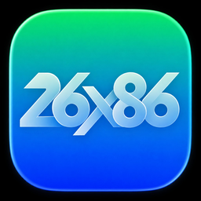

# 26x86

<h1>26x86</h1>
<h3>x86 Mac을 위한 macOS 26 (Tahoe) 패처</h3>

> **실험적 알파** — [면책 조항](DISCLAIMER.md) 확인 · **전체 백업** 후 테스트용 Mac에서 시험하세요.

## 문서

| 문서 | 설명 |
|------|------|
| **[위키 홈](docs/wiki/Home.md)** | 주의사항, 설치, 설정, 이전 패처에서 전환 |
| [Releases](https://github.com/NiSeullent/26x86/releases) | 안정 빌드 |
| [SOURCE.md](SOURCE.md) | 소스 실행·빌드 |

영문: [docs/README.en.md](docs/README.en.md)

## 실행

`26x86.command` 또는 `python3 -m x86 wizard`

## Windows EXE CI 빌드

- 워크플로우: `.github/workflows/windows-exe.yml`
- 실행 조건: `main` 브랜치 `push`, `main` 대상 `pull_request`, 수동 `workflow_dispatch`
- 빌드 명령: `.\scripts\build-windows-exe.ps1 -Clean` (내부적으로 `python -m PyInstaller 26x86-Windows.spec`)
- 산출물: Actions Artifact `26x86-windows-exe` (내용: `dist/**`, 실행 파일 `dist/26x86/26x86.exe`)

### 아티팩트 다운로드

1. GitHub 저장소의 [Actions](https://github.com/NiSeullent/26x86/actions) 탭 진입
2. `Build Windows EXE` 워크플로우 실행 선택
3. 페이지 하단 `Artifacts`에서 `26x86-windows-exe` 다운로드

### 실패 시 빠른 점검

- `No module named webview`: 빌드 로그의 의존성 설치 단계에서 `pywebview` 설치 성공 여부 확인
- EXE 실행 시 빈 화면: 대상 PC에 Microsoft Edge WebView2 Runtime 설치 확인
- `dist/26x86/26x86.exe not found`: PyInstaller 단계 실패 로그(숨김 import/경로 오류) 확인

## 법적

[DISCLAIMER.md](DISCLAIMER.md) · [LICENSE.txt](LICENSE.txt) · [NOTICE.md](NOTICE.md) · [원본 저장소](docs/wiki/Upstream-Repositories.md) · [CREDITS.md](CREDITS.md)
