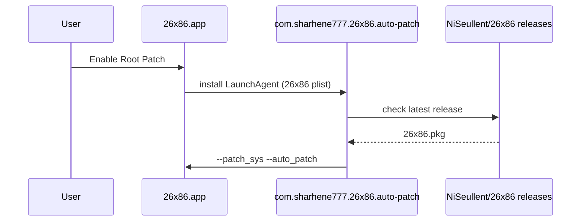

# 26x86 Native Architecture

> **26x86 독립 아키텍처 설계서**  
> OpenCore Legacy Patcher (OCLP) / Dortania / albert-mueller T2 fork와의 **런타임 결합을 완전히 제거**하고, NiSeullent/26x86 제품 정체성으로 통일한다.

---

## English Summary

26x86 is a T2-focused macOS patcher fork that must operate independently from Dortania OCLP at runtime. All settings, launchd labels, bundle IDs, app support paths, update endpoints, and upstream package downloads are namespaced under `com.sharhene777.26x86` and `NiSeullent/*` GitHub forks. Legacy OCLP shared state (`/Users/Shared/.com.dortania.opencore-legacy-patcher.plist`) may be **read once** for migration but must never be written. Internal Python package name `opencore_legacy_patcher` remains for compatibility; user-facing identity is **26x86**.

---

## 1. 아키텍처 원칙

### 1.1 금지 규칙 (Runtime FORBIDDEN)

| 금지 항목 | 이유 |
|-----------|------|
| `/Users/Shared/.com.dortania.opencore-legacy-patcher.plist` 읽기/쓰기 (마이그레이션 1회 제외) | root 소유 파일, OCLP 공유 상태 오염 |
| `com.dortania.opencore-legacy-patcher.*` launchd 등록/참조 | OCLP 자동 패치와 충돌 |
| `/Library/Application Support/Dortania/` | 레거시 앱 설치 경로 |
| `albert-mueller/*`, `dortania/OCLP`, `YBronst/PatcherSupportPkg` API/다운로드 | upstream fork 의존 |
| 런타임에서 OCLP plist 키 namespace 사용 | 설정 충돌 |

### 1.2 허용 (Non-runtime OK)

- `CREDITS.md`, `NOTICE.md`, `THIRD_PARTY_LICENSES.md`의 upstream URL
- 코드 주석의 GitHub issue/commit 참조
- OpenCore Install Guide 등 **외부 문서** 링크 (사용자 선택)

---

## 2. 네임스페이스 매핑

| Domain | OCLP (OLD) | 26x86 (NEW) |
|--------|------------|-------------|
| **Settings plist** | `/Users/Shared/.com.dortania.opencore-legacy-patcher.plist` | `~/Library/Preferences/com.sharhene777.26x86.plist` |
| **App Support** | `/Library/Application Support/Dortania/` | `/Library/Application Support/26x86/` |
| **User App Support** | — | `~/Library/Application Support/26x86/` |
| **Bundle ID** | `com.dortania.opencore-legacy-patcher` | `com.sharhene777.26x86` |
| **Privileged Helper** | `com.dortania.opencore-legacy-patcher.privileged-helper` | `com.sharhene777.26x86.privileged-helper` |
| **LaunchAgents** | `com.dortania.opencore-legacy-patcher.auto-patch` | `com.sharhene777.26x86.auto-patch` |
| **LaunchDaemons** | `com.dortania.opencore-legacy-patcher.{macos-update,rsr-monitor,os-caching}` | `com.sharhene777.26x86.{macos-update,rsr-monitor,os-caching}` |
| **App binary** | `OpenCore-Patcher.app` / `OpenCore-Patcher` | `26x86.app` / `26x86` |
| **Config keys** | OCLP defaults keys | `26x86.*` namespace (예: `26x86.auto_patch`, `26x86.verbose_logging`) |
| **Logs** | `/Users/Shared/OpenCore-Patcher_*` | `~/Library/Logs/26x86/` |
| **Dev mode marker** | `~/.dortania_developer` | `~/.26x86_developer` |
| **Updates API** | `api.github.com/repos/albert-mueller/...` | `api.github.com/repos/NiSeullent/26x86/...` |
| **PatcherSupportPkg** | YBronst/hackdoc | NiSeullent/26x86-PatcherSupportPkg |
| **OpenCorePkg** | albert-mueller releases | NiSeullent/26x86-OpenCorePkg |
| **MetallibSupportPkg** | dortania / albert-mueller | NiSeullent/26x86-MetallibSupportPkg |

---

## 3. 모듈 아키텍처

```
26x86/
├── 26x86-GUI.command          # 진입점 (구 OpenCore-Patcher-GUI.command)
├── 26x86-GUI.spec             # PyInstaller spec
├── opencore_legacy_patcher/   # 내부 패키지 (이름 유지)
│   ├── constants.py           # 단일 진실 원천: bundle_id, paths, URLs
│   ├── support/
│   │   ├── settings_store.py  # NEW: 26x86 설정 API (읽기/쓰기/마이그레이션)
│   │   ├── global_settings.py # → settings_store 위임
│   │   ├── analytics_handler.py
│   │   ├── subprocess_wrapper.py  # privileged helper path
│   │   └── updates.py
│   ├── sys_patch/
│   │   └── auto_patcher/
│   │       ├── start.py       # NiSeullent/26x86 release API
│   │       └── install.py     # 26x86 launchd paths
│   └── wx_gui/
│       └── gui_update.py      # 26x86.pkg, 26x86.app
├── payloads/
│   ├── Launch Services/
│   │   └── com.sharhene777.26x86.*.plist
│   └── Tools/
│       └── 26x86.app/
├── ci_tooling/                # 빌드 시에만 dortania 참조 제거
└── docs/
    ├── ARCHITECTURE-26x86.md  # (본 문서)
    ├── DEPENDENCY-AUDIT.md
    └── wiki/
        ├── Configuration.md
        └── Migration-from-OCLP.md
```

### 3.1 Settings Store (핵심 API)

```python
# opencore_legacy_patcher/support/settings_store.py (신규)

class SettingsStore:
    """26x86-native settings — never writes OCLP plist."""

    PREFERENCES_PATH = ~/Library/Preferences/com.sharhene777.26x86.plist
    LEGACY_OCLP_PATH = /Users/Shared/.com.dortania.opencore-legacy-patcher.plist  # read-only migration

    def read(key) -> Any
    def write(key, value) -> None
    def migrate_from_oclp_once() -> bool   # idempotent, sets 26x86.migrated_from_oclp
```

**마이그레이션 정책:**
1. 26x86 plist 없음 + OCLP plist 읽기 가능 → 키 복사 (1회)
2. OCLP plist root 소유 → 건너뛰기, 사용자에게 선택적 삭제 안내 (강제 `sudo rm` 아님)
3. 이후 모든 read/write는 26x86 plist만

### 3.2 Launchd / Auto-Patcher 흐름



### 3.3 업데이트 파이프라인

| 단계 | OCLP | 26x86 |
|------|------|-------|
| API | albert-mueller/OCLP-T2 | NiSeullent/26x86 |
| Download | OpenCore-Patcher.pkg.zip | 26x86.pkg |
| Install path | Application Support/Dortania | Application Support/26x86 |
| Post-install | OpenCore-Patcher --update_installed | 26x86 --update_installed |

---

## 4. 마이그레이션 계획 (4 Workers)

### Phase A — `runtime-config` (Worker A)

| 파일 | 변경 |
|------|------|
| `constants.py` | `app_name`, `launcher_binary`, launchd path properties 추가 |
| `settings_store.py` | **신규** — 단일 settings API |
| `global_settings.py` | settings_store 위임, OCLP write 제거 |
| `utilities.py`, `gui_settings.py`, `gui_support.py` | dortania developer → 26x86 |
| `analytics_handler.py` | analytics domain/path |
| `device_probe.py` | OCLP 경로 참조 제거 |
| `logging_handler.py` | `~/Library/Logs/26x86/` |
| `subprocess_wrapper.py` | 26x86 privileged helper |

### Phase B — `payloads-launchd` (Worker B)

| 파일 | 변경 |
|------|------|
| `payloads/Launch Services/com.dortania.*` | **삭제** (com.sharhene777.26x86.* 유지/완성) |
| `payloads/Tools/OpenCore-Patcher.app` | → `26x86.app` rename + Info.plist |
| `sys_patch/auto_patcher/install.py` | constants 기반 launchd paths |
| `Build-Project.command`, `package.py`, `package_scripts.py` | 26x86 bundle IDs |
| `OpenCore-Patcher-GUI.spec` | → `26x86-GUI.spec` |

### Phase C — `urls-forks` (Worker C)

| 파일 | 변경 |
|------|------|
| `constants.py` URLs | NiSeullent forks (일부 이미 완료) |
| `auto_patcher/start.py` | NiSeullent/26x86 API |
| `gui_main_menu.py`, `gui_update.py`, `gui_help.py` | NiSeullent URLs |
| `metallib_handler.py`, `validation.py`, `disk_images.py` | NiSeullent forks |
| `dmg_mount.py` | 26x86 internal resources naming |
| `Update-OpenCore.command`, `Update-Kexts.command` | fork URLs |
| `reroute_payloads.py` | 26x86 paths |

### Phase D — `docs-wiki-cleanup` (Worker D)

| 파일 | 변경 |
|------|------|
| `docs/wiki/Configuration.md` | **신규** — 26x86 설정 경로 |
| `docs/wiki/Migration-from-OCLP.md` | **신규** — OCLP 공존/마이그레이션 (sudo rm 선택적) |
| `archive/` | EFI_COMPARISON*, verify_efi.py 등 이미 archive됨 — README 추가 |
| `README.md` | wiki 링크로 슬림화 |

---

## 5. OCLP 공존 시나리오

| 시나리오 | 26x86 동작 |
|----------|-----------|
| OCLP 미설치 | 정상 — 26x86 plist만 사용 |
| OCLP 설치 + shared plist 읽기 가능 | 1회 마이그레이션 후 26x86 plist |
| OCLP 설치 + root-owned shared plist | 마이그레이션 skip, 26x86 기본값; 사용자가 OCLP plist 수동 삭제 가능 |
| OCLP + 26x86 동시 launchd | **지원 안 함** — 26x86 설치 시 dortania launchd 제거 스크립트 제공 |

---

## 6. 검증 체크리스트

- [ ] grep baseline 115 → target < 30 (주석/kext plist/CREDITS 제외 시 **0**)
- [ ] `--help` / `--detect --json` 성공
- [ ] Settings: `~/Library/Preferences/com.sharhene777.26x86.plist` 생성 확인
- [ ] OCLP plist에 write 없음 (strace/dtrace 또는 unit test)
- [ ] LaunchAgent label = `com.sharhene777.26x86.auto-patch`
- [ ] Update API → NiSeullent/26x86 only
- [ ] `wx.FileExists` → `Path.exists()` 회귀 없음

---

## 7. 변경 이력

| 날짜 | 버전 | 내용 |
|------|------|------|
| 2026-09-04 | 1.0 | 초기 아키텍처 문서 + 115건 감사 baseline |
| 2026-09-04 | 1.1 | Workers A–D 통합 완료, grep 115→27, `settings_store.py`·26x86 launchd·NiSeullent URLs |
